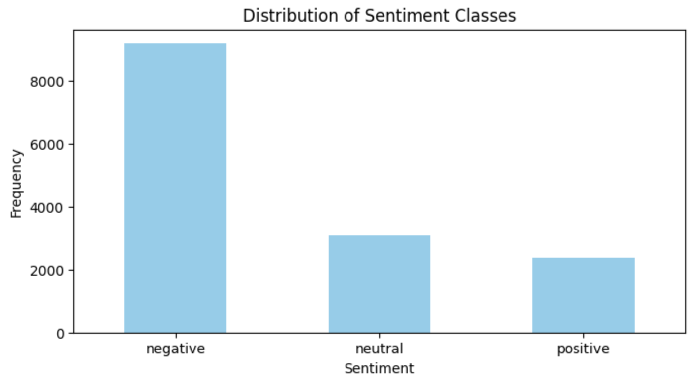
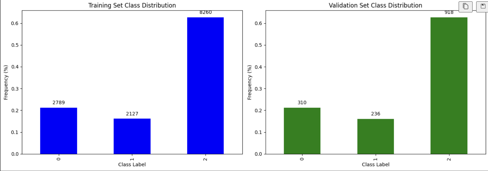
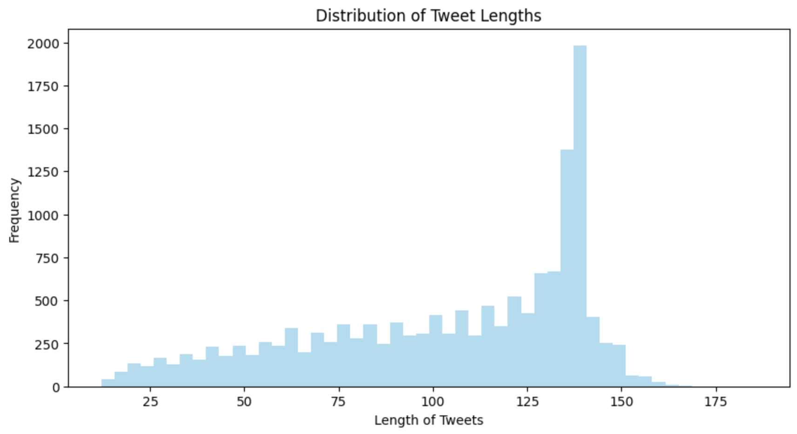
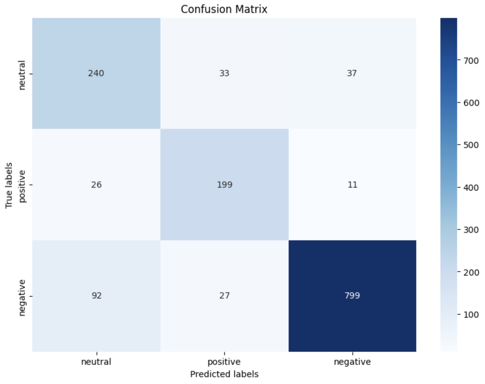

# BERT-Sentiment-FlightReviews


### Introduction

This repository hosts a PyTorch-based machine learning model for sentiment analysis of airline tweets. The model leverages the BERT architecture, fine-tuned to classify tweets into three sentiment categories: positive, neutral, and negative. This project also includes a Streamlit application that serves as an interactive interface for real-time sentiment analysis.

## Features

- **BERT Sentiment Classification**: Utilizes a pre-trained BERT model fine-tuned for sentiment classification of airline tweets.
- **Interactive Web Application**: A Streamlit application that provides an easy-to-use interface for predicting sentiments directly from user input.
- **Comprehensive Data Visualization**: Generates visual insights into the dataset, such as sentiment distribution and tweet length histograms.
- **Detailed Performance Metrics**: Outputs performance metrics such as accuracy, F1-score, precision, and recall to evaluate model effectiveness.

## Project Structure

The repository is organized as follows:

Each component is crucial for the setup and execution of the sentiment analysis model:
- **app.py**: The Streamlit application file for interactive sentiment prediction.
- **model/**: Contains the saved BERT model and tokenizer necessary for running the predictions.
- **requirements.txt**: Lists all the Python dependencies required to run the project.
- **data/Tweets.csv**: The dataset used for training the model, featuring airline tweets labeled by sentiment.
- **Twitter_US_Airline_sentiment.ipynb**: A Jupyter notebook detailing the process of data handling, analysis, and model training.

This structure ensures that users can easily navigate and utilize the components of this sentiment analysis project.

### Dataset

The model is trained on a dataset consisting of airline tweets tagged with sentiments. This dataset allows the model to understand and predict the sentiment of unseen airline-related tweets based on the training it has received.

The raw data was unbalanced, with a predominance of negative sentiments, as shown in the image below:




### Data Split

The dataset was split into training and validation sets in a stratified manner to ensure that the distribution of sentiments was maintained in both sets. This approach helps in evaluating the model's performance on unseen data while preserving the representation of each sentiment category.




### Data Length Distribution

The distribution of tweet lengths in the dataset was visualized using the  notebook. This visualization provided insights into the distribution of tweet lengths and helped determine an appropriate maximum length for the BERT model.

Based on the analysis, it was observed that the majority of tweets had a length of less than 200 characters. Therefore, the maximum length for the BERT model was set to 200 to ensure that most tweets could be accommodated without truncation.

This decision was made to strike a balance between capturing sufficient information from the tweets and avoiding unnecessary computational overhead.

### Installation

- Prerequisites
    - Python 3.x
    - pip

- Setup

Clone this repository and install the necessary Python packages using the following commands:

```python
git clone https://github.com/pratheeshkumar99/BERT-Sentiment-FlightReview.git
cd BERT-Sentiment-FlightReview
pip install -r requirements.txt
```

### Usage

#### Running the Streamlit Application

Make sure you have installed all the necessary Python packages mentioned in the installation section before running the application.

To start the Streamlit web application, run the following command from the root directory of the project:

```bash
streamlit run app.py
```

This will start a web server and open the application in your default web browser.

### Training the Model

To train the model from scratch or fine-tune it further, follow these steps:

1. Ensure your dataset is formatted correctly and placed in the `data/` directory.
2. Modify the `Twitter_US_Airline_sentiment.ipynb` script if necessary to adjust model parameters, training epochs, or data preprocessing methods.
3. Execute the training script in the Jupyter notebook.

This will begin the training process, and the model's performance metrics will be outputted upon completion.

### Visualization

The project includes scripts to visualize data and results:

- Data Distribution: Run the `data_analysis.ipynb` notebook to generate plots showing the distribution of tweet lengths and sentiments.
- Model Accuracy: After training, confusion matrices and other performance metrics can be visualized to assess model accuracy.

Configuration

Model and training configurations can be adjusted in the `Twitter_US_Airline_sentiment.ipynb` script. Parameters such as batch size, number of epochs, and learning rate can be tuned to improve model performance.


## Model Training and Evaluation

### Data Distribution

The dataset comprised tweets categorized into three sentiment classes: negative, neutral, and positive. The distribution of these classes was notably imbalanced, with a predominance of negative sentiments, which influenced the approach to model training and loss calculation.


### Handling Imbalance

To address the class imbalance, we utilized a weighted loss function during training. This approach helped in emphasizing the minority classes, thereby aiming for a more balanced classification performance across all sentiment categories.

### Training Process

The model underwent fine-tuning over two epochs using a pretrained base to leverage its established learning patterns, which were further adapted to our specific dataset characteristics:

- Epoch 1: Began with a training loss of 0.1377, concluding with a validation loss of 0.1097. Metrics included an accuracy of 79.03% and an F1 score of 0.8005.
- Epoch 2: Training loss decreased to 0.0724, while validation loss slightly increased to 0.1125. The metrics improved with an accuracy of 84.56% and an F1 score of 0.8495.

### Evaluation Metrics

The model’s performance was rigorously assessed through a confusion matrix, illustrating the classification accuracy across different sentiment labels:



This matrix was crucial for identifying how effectively the model recognized each sentiment, highlighting specific challenges in classifying neutral tweets.

### Conclusion

The training process demonstrated considerable initial success, stabilizing in subsequent epochs. We opted to cease further training after two epochs to avoid overfitting and to preserve the model’s ability to generalize across different datasets. The use of weighted loss significantly contributed to addressing the class imbalance, reflecting in the enhanced accuracy and F1 scores.
